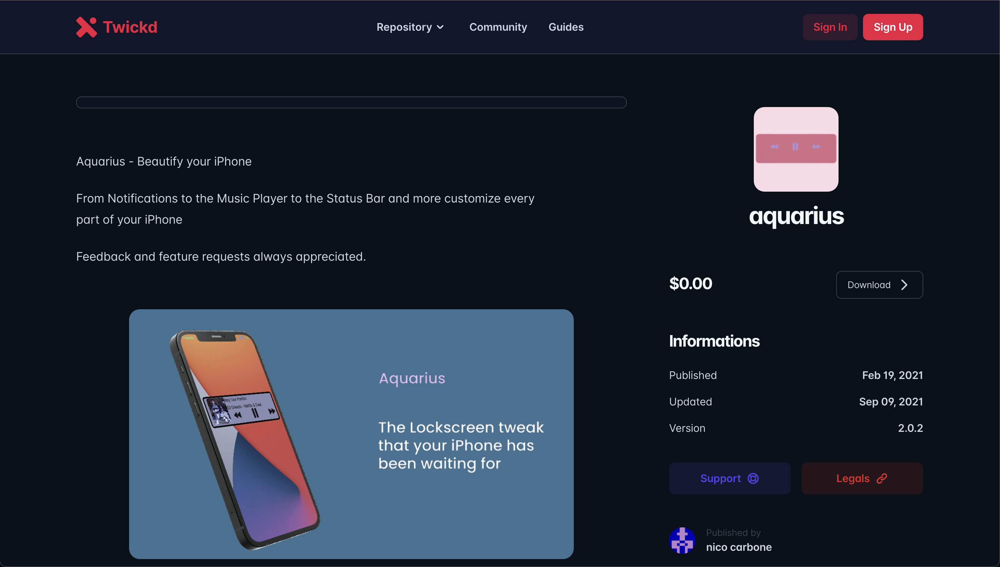

# Aquarius (Archived)

Aquarius is an iPhone tweak designed to run on jailbroken iPhones running iOS 14.0-14.2.

Aquarius empowers users with more personal choice over the visual customization of their iPhones. It allows them to modify the appearance of various iOS UI elements, ranging from the lockscreen music player to the presentation of notifications.

## Features

- **UI Customization:** Modify the appearance of essential iOS elements.
- **Compatibility:** Designed to work on jailbroken iPhones running iOS 14.0-14.2.
- **Community Driven:** Aquarius gained popularity with over 2.6k concurrent users downloading it from the Twickd tweak repository.

## No Longer Under Development

Please note that as of 2021, this project is no longer under active development. Feel free to fork and continue the project if you wish.

## Links

<https://repo.twickd.com/get/com.twickd.nico-carbone.aquarius>
<https://www.idownloadblog.com/2021/03/04/aquarius/>

## Images

